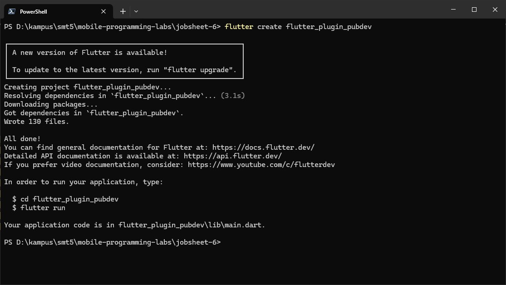
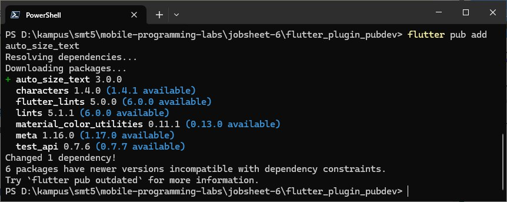
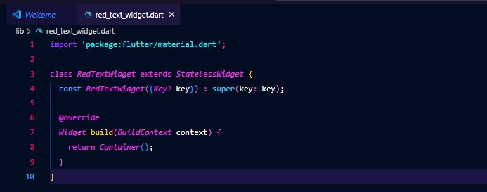
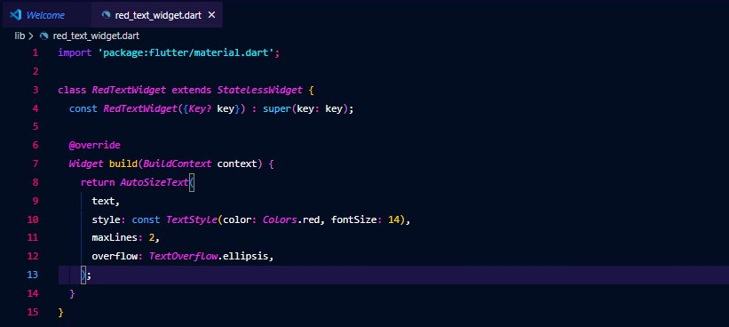
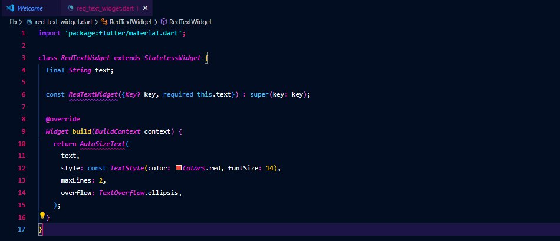
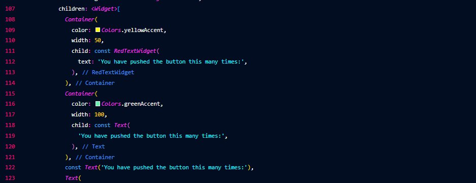
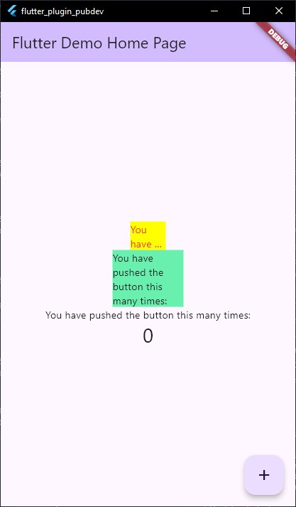

# Jobsheet 6 - Auto Size Text

**Nama:** Revani Nanda Putri  
**NIM:** 2341760056  
**Kelas:** SIB - 3D  

---

## Dokumentasi Praktikum

Link proyek:
https://github.com/revaniputeri/mobile-programming-labs/tree/main/jobsheet-6

### Langkah 1
  
**Penjelasan:**  
Pada langkah ini, proyek Flutter dijalankan untuk memastikan semua dependensi terpasang dengan benar. Hal ini bertujuan untuk memverifikasi bahwa aplikasi dapat berjalan tanpa error sebelum dilakukan penambahan widget baru.

---

### Langkah 2
  
**Penjelasan:**  
Langkah ini menambahkan dependensi `auto_size_text` pada file **pubspec.yaml**. Dependensi ini digunakan untuk membuat teks secara otomatis menyesuaikan ukuran font-nya agar pas di dalam area widget tanpa terpotong.

**Jawaban Pertanyaan No. 2:**  
Maksud dari langkah 2 adalah **menambahkan library eksternal `auto_size_text`** agar Flutter dapat menggunakan fitur penyesuaian otomatis ukuran teks. Tanpa menambahkan ini, widget tersebut tidak akan dikenali oleh Flutter.

---

### Langkah 3
  
**Penjelasan:**  
Buat file baru bernama red_text_widget.dart di dalam folder lib lalu isi kode seperti gambar di atas.

### Langkah 4

**Penjelasan:**
Masih di file red_text_widget.dart, untuk menggunakan plugin auto_size_text, ubahlah kode return Container() menjadi seperti berikut. Setelah Anda menambahkan kode di atas, Anda akan mendapatkan info error. Mengapa demikian? Jelaskan dalam laporan praktikum Anda!    
#### Jawab:  
Widget AutoSizeText mulai digunakan di dalam Scaffold untuk menggantikan widget Text. Tujuannya adalah agar teks secara otomatis menyesuaikan ukuran font dengan lebar ruang yang tersedia.  

### Langkah 5

**Penjelasan:**
Tambahkan variabel text dan parameter di constructor seperti gambar diatas.

**Jawaban Pertanyaan No. 3:**   
Maksud dari langkah 5 adalah mengatur batasan tampilan teks dan gaya font, seperti berapa baris maksimal yang ditampilkan (maxLines) serta bagaimana teks diperlakukan jika panjang (overflow). Ini membantu menjaga tampilan tetap rapi di berbagai ukuran layar.

### Langkah 6

**Penjelasan:**
Pada langkah ini, dua widget digunakan untuk menampilkan teks yang dapat menyesuaikan ukurannya secara otomatis.  

**Jawaban Pertanyaan No. 4:**  
Dua widget yang ditambahkan memiliki fungsi dan perbedaan berikut:
1. AutoSizeText, otomatis menyesuaikan ukuran teks agar muat di ruang yang tersedia.
2. Text, memiliki ukuran teks statis dan tidak berubah meskipun ruangnya sempit.

Perbedaan utamanya adalah AutoSizeText bersifat responsif terhadap ukuran ruang, sementara Text tidak.

### Langkah 7
   
**Penjelasan:**
Run Project
