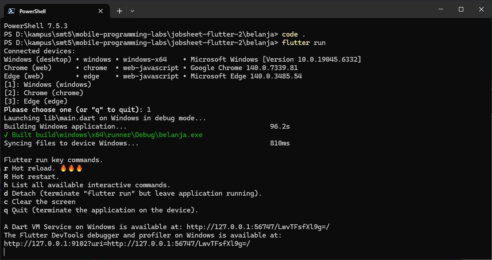
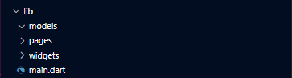
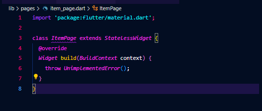
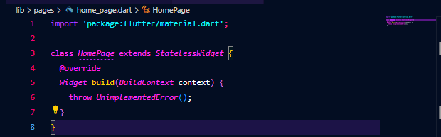
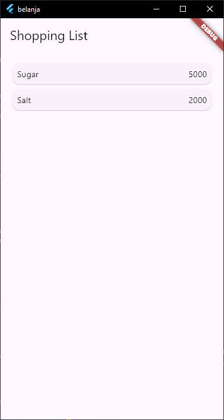
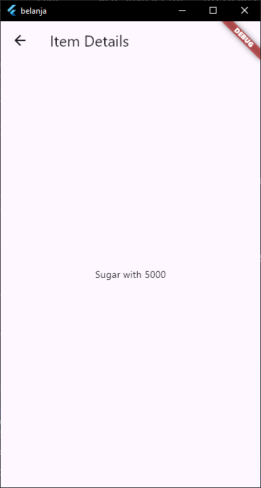
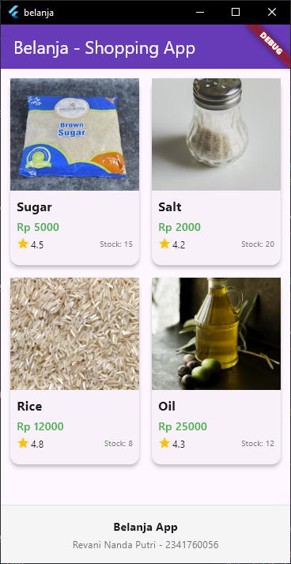
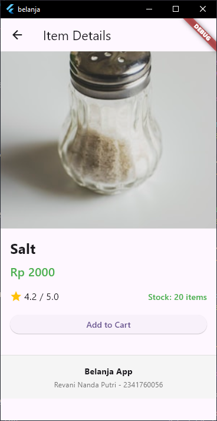

# Layout Flutter - Jobsheet 5

**Mata Kuliah**: Pemograman Mobile  
**Program Studi**: D4 – Sistem Informasi Bisnis  
**Semester**: 5  
**Kelas**: SIB  
**NIM**: 2341760056  
**Nama**: Revani Nanda Putri  
**Jobsheet Ke-**: 5 (Flutter 2)  

---

## Laporan Jobsheet

### Praktikum Ke-5 (Membangun Navigasi di Flutter)

| Langkah | Jawaban/Deskripsi |
|---------|-------------------|
| 1 | buatlah sebuah project baru Flutter dengan nama belanja dan susunan folder seperti pada gambar berikut. Penyusunan ini dimaksudkan untuk mengorganisasi kode dan widget yang lebih mudah.<br><br> <br><br>|
| 2 | Buatlah dua buah file dart dengan nama home_page.dart dan item_page.dart pada folder pages. Untuk masing-masing file, deklarasikan class HomePage pada file home_page.dart dan ItemPage pada item_page.dart. Turunkan class dari StatelessWidget.<br><br><br><br> |
| 3 | Mendefinisikan Route untuk kedua halaman tersebut. Definisi penamaan route harus bersifat unique. Halaman HomePage didefinisikan sebagai `/`. Dan halaman ItemPage didefinisikan sebagai `/item`. Untuk mendefinisikan halaman awal, anda dapat menggunakan `named argument initialRoute`. seperti kode berikut: 

**Code Implementation:**

**lib/main.dart**
```dart
import 'package:flutter/material.dart';
import 'pages/home_page.dart';
import 'pages/item_page.dart';

void main() {
  runApp(const MyApp());
}

class MyApp extends StatelessWidget {
  const MyApp({super.key});

  @override
  Widget build(BuildContext context) {
    return MaterialApp(
      title: 'Belanja',
      theme: ThemeData(
        colorScheme: ColorScheme.fromSeed(seedColor: Colors.deepPurple),
      ),
      initialRoute: '/',
      routes: {
        '/': (context) => HomePage(),
        '/item': (context) => ItemPage(),
      },
    );
  }
}

``` 
|  |  |
|---------|-------------------|
| 4 | Buatlah sebuah file dengan nama `item.dart` dan letakkan pada folder models. Pada file ini didefinisikan pemodelan data yang dibutuhkan. Berikut contoh implementasinya:
**lib/models/item.dart**
```dart
class Item {
  String name;
  int price;

  Item({required this.name, required this.price});
}
```
|  |  |
|---------|-------------------|
| 5 | Pada halaman HomePage terdapat ListView widget. Sumber data ListView diambil dari model List dari object Item. Berikut contoh implementasinya:
**lib/models/item.dart**
```dart
class Item {
  String name;
  int price;

  Item({required this.name, required this.price});
}
```

|  |  |
|---------|-------------------|
| 6 | menampilkan ListView pada praktikum ini digunakan itemBuilder. Data diambil dari definisi model yang telah dibuat sebelumnya. Untuk menunjukkan batas data satu dan berikutnya digunakan widget Card. Berikut contoh implementasinya:
**lib/pages/home_page.dart**
```dart
import 'package:flutter/material.dart';
import '../models/item.dart';

class HomePage extends StatelessWidget {
  HomePage({Key? key}) : super(key: key);

  final List<Item> items = [
    Item(name: 'Sugar', price: 5000),
    Item(name: 'Salt', price: 2000)
  ];

  @override
  Widget build(BuildContext context) {
    return Scaffold(
      appBar: AppBar(
        title: Text('Shopping List'),
      ),
      body: Container(
        margin: EdgeInsets.all(8),
        child: ListView.builder(
          padding: EdgeInsets.all(8),
          itemCount: items.length,
          itemBuilder: (context, index) {
            final item = items[index];
            return Card(
              child: Container(
                margin: EdgeInsets.all(8),
                child: Row(
                  children: [
                    Expanded(child: Text(item.name)),
                    Expanded(
                      child: Text(
                        item.price.toString(),
                        textAlign: TextAlign.end,
                      ),
                    ), // Text
                  ], // Row
                ), // Container
              ), // Container
            ); // Card
          },
        ), // ListView.builder
      ), // Container
    );
  }
}
```
### Hasil:

|  |  |
|---------|-------------------|
| 7 | Menambahkan navigasi pada ListView menggunakan widget InkWell. Wrap Card dengan InkWell dan tambahkan onTap untuk navigasi ke ItemPage dengan mengirim data item sebagai arguments. Berikut contoh implementasinya:
**lib/pages/home_page.dart**
```dart
return InkWell(
  onTap: () {
    Navigator.pushNamed(context, '/item', arguments: item);
  },
  child: Card(
    child: Container(
      margin: EdgeInsets.all(8),
      child: Row(
        children: [
          Expanded(child: Text(item.name)),
          Expanded(
            child: Text(
              item.price.toString(),
              textAlign: TextAlign.end,
            ),
          ),
        ],
      ),
    ),
  ),
);
```

**lib/pages/item_page.dart**
```dart
import 'package:flutter/material.dart';
import '../models/item.dart';

class ItemPage extends StatelessWidget {
  const ItemPage({Key? key}) : super(key: key);

  @override
  Widget build(BuildContext context) {
    final Item item = ModalRoute.of(context)!.settings.arguments as Item;
    
    return Scaffold(
      appBar: AppBar(
        title: Text('Item Details'),
      ),
      body: Center(
        child: Text('${item.name} with ${item.price}'),
      ),
    );
  }
}
```
### Hasil:


---

## Laporan Tugas Praktikum 2

### Implementasi Pengembangan Aplikasi Belanja

Pada tugas praktikum ini, dilakukan pengembangan lebih lanjut terhadap aplikasi belanja yang telah dibuat pada praktikum sebelumnya. Berikut adalah implementasi dari setiap poin tugas yang diberikan:

#### 1. Implementasi Pengiriman Data Antar Halaman

Pengiriman data dari HomePage ke ItemPage berhasil diimplementasikan menggunakan parameter `arguments` pada Navigator. Implementasi dilakukan dengan menambahkan kode berikut pada fungsi navigasi:

```dart
Navigator.pushNamed(context, '/item', arguments: item);
```

#### 2. Implementasi Pembacaan Data dari Halaman Sebelumnya

Proses pembacaan data yang dikirimkan dari halaman sebelumnya berhasil diimplementasikan menggunakan ModalRoute. Data dapat diakses dan digunakan dengan kode sebagai berikut:

```dart
final itemArgs = ModalRoute.of(context)!.settings.arguments as Item;
```
*Referensi: [Flutter Documentation - Navigate with Arguments](https://docs.flutter.dev/cookbook/navigation/navigate-with-arguments)*

#### 3. Pengembangan Model Data dan Tampilan GridView

Model Item telah dikembangkan dengan menambahkan atribut tambahan berupa foto produk (imageUrl), stok, dan rating. Tampilan ListView telah diubah menjadi GridView untuk memberikan pengalaman seperti aplikasi marketplace pada umumnya. Implementasi ini mencakup:
- Penambahan atribut `imageUrl`, `stock`, dan `rating` pada model Item
- Perubahan layout dari ListView ke GridView dengan 2 kolom
- Desain card yang menampilkan gambar, nama, harga, rating, dan stok produk

#### 4. Implementasi Hero Widget untuk Animasi Transisi

Hero widget berhasil diimplementasikan untuk memberikan animasi transisi yang smooth antara gambar produk di HomePage dan ItemPage. Implementasi menggunakan tag unik `'product-${item.name}'` untuk menghubungkan kedua widget Hero.

*Referensi: [Flutter Documentation - Hero Animations](https://docs.flutter.dev/cookbook/navigation/hero-animations)*

#### 5. Peningkatan Desain User Interface

Aplikasi telah mengalami peningkatan signifikan dalam hal desain dan struktur kode:
- Desain visual yang lebih menarik dengan color scheme yang konsisten
- Pemecahan widget menjadi komponen yang lebih kecil dan reusable
- Penambahan footer yang mencantumkan nama dan NIM pengembang
- Error handling untuk gambar yang gagal dimuat
- Implementasi feedback berupa SnackBar pada tombol "Add to Cart"

#### 6. Eksplorasi Plugin Go Router

Telah dilakukan eksplorasi terhadap plugin go_router sebagai alternatif untuk sistem navigasi. Plugin ini telah ditambahkan ke dalam dependencies dan dikonfigurasi untuk routing yang lebih advanced, meskipun implementasi masih menggunakan Navigator tradisional untuk menjaga kompatibilitas.

### Hasil Akhir

Aplikasi belanja yang telah dikembangkan memiliki fitur-fitur berikut:
- Tampilan grid marketplace dengan 4 produk sample
- Hero animation untuk transisi gambar
- Detail produk lengkap dengan rating dan stok
- UI yang responsive dan user-friendly
- Footer dengan identitas pengembang

   
