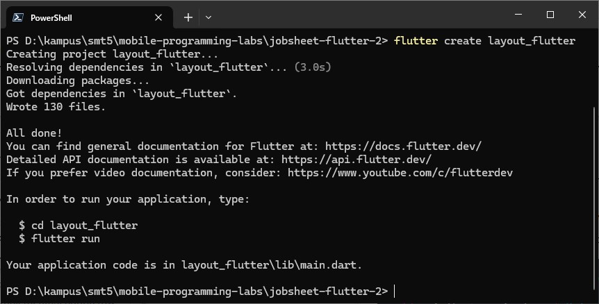
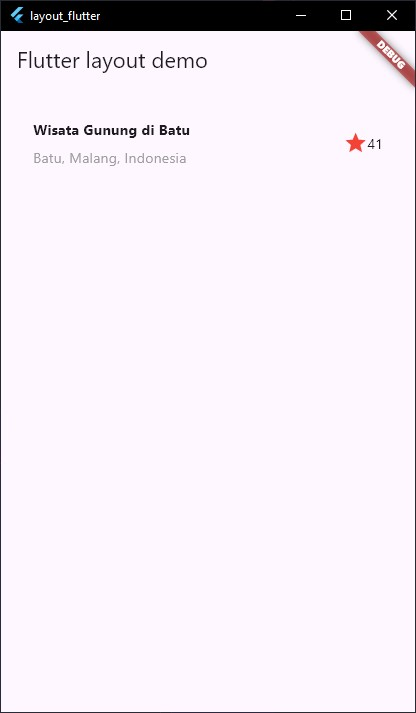

# Layout Flutter - Jobsheet 5

**Mata Kuliah**: Pemograman Mobile  
**Program Studi**: D4 – Sistem Informasi Bisnis  
**Semester**: 5  
**Kelas**: SIB  
**NIM**: 2341760056  
**Nama**: Revani Nanda Putri  
**Jobsheet Ke-**: 5 (Flutter 2)  

---

## Laporan Jobsheet

### Praktikum Ke-1 (Membangun Layout di Flutter)

| Langkah | Jawaban/Deskripsi |
|---------|-------------------|
| 1 | Membuat project flutter dengan nama layout_flutter.<br><br> |
| 2 | Buka file main.dart lalu ganti dengan kode berikut. Isi nama dan NIM Anda di text title.<br><br> |
| 3 | Mengimplementasikan title row dengan membuat kolom bagian kiri pada judul. Saya membuat file baru di dalam folder `lib/widgets/title_section.dart` lalu dipanggil ke `lib/main. seperti kode berikut: |

**Code Implementation:**

**lib/widgets/title_section.dart**
```dart
import 'package:flutter/material.dart';

class TitleSection {
  static Widget buildTitleSection() {
    return Container(
      padding: const EdgeInsets.all(32),
      child: Row(
        children: [
          Expanded(
            /* soal 1*/
            child: Column(
              crossAxisAlignment: CrossAxisAlignment.start,
              children: [
                 /* soal 2*/
                Container(
                  padding: const EdgeInsets.only(bottom: 8),
                  child: const Text(
                    'Wisata Gunung Bromo',
                    style: TextStyle(
                      fontWeight: FontWeight.bold,
                    ),
                  ),
                ),
                Text(
                  'Jawa Timur, Indonesia',
                  style: TextStyle(
                    color: Colors.grey,
                  ),
                ),
              ],
            ),
          ),
          /* soal 3*/
          Icon(
            Icons.star,
            color: Colors.red,
          ),
          const Text('41'),
        ],
      ),
    );
  }
}
```

**lib/main.dart**
```dart
import 'package:flutter/material.dart';
import 'widgets/title_section.dart';

void main() => runApp(const MyApp());

class MyApp extends StatelessWidget {
  const MyApp({super.key});

  @override
  Widget build(BuildContext context) {
    return MaterialApp(
      title: 'Flutter layout: Revani Nanda Putri - 2341760056',
      home: Scaffold(
        appBar: AppBar(
          title: const Text('Flutter layout demo'),
        ),
        body: Column(
          children: [
            TitleSection.buildTitleSection(),
          ],
        ),
      ),
    );
  }
}
```

### Hasil:


---

### Praktikum Ke-2 (Implementasi button row)

| Langkah | Jawaban/Deskripsi |
|---------|-------------------|
| 1 | Buat method Column _buildButtonColumn. Bagian tombol berisi 3 kolom yang menggunakan tata letak yang sama—sebuah ikon di atas baris teks. Kolom pada baris ini diberi jarak yang sama, dan teks serta ikon diberi warna primer.<br><br> |
| 2 | Buat Fungsi untuk menambahkan ikon langsung ke kolom. Teks berada di dalam Container dengan margin hanya di bagian atas, yang memisahkan teks dari ikon.<br><br> |
| 3 | Implementasi button section dengan membuat file terpisah `lib/widgets/button_section.dart` |

**Code Implementation:**

**lib/widgets/button_section.dart**
```dart
import 'package:flutter/material.dart';

class ButtonSection {
  static Widget buildButtonSection(BuildContext context) {
    Color color = Theme.of(context).primaryColor;

    return Row(
      mainAxisAlignment: MainAxisAlignment.spaceEvenly,
      children: [
        _buildButtonColumn(color, Icons.call, 'CALL'),
        _buildButtonColumn(color, Icons.near_me, 'ROUTE'),
        _buildButtonColumn(color, Icons.share, 'SHARE'),
      ],
    );
  }

  static Column _buildButtonColumn(Color color, IconData icon, String label) {
    return Column(
      mainAxisSize: MainAxisSize.min,
      mainAxisAlignment: MainAxisAlignment.center,
      children: [
        Icon(icon, color: color),
        Container(
          margin: const EdgeInsets.only(top: 8),
          child: Text(
            label,
            style: TextStyle(
              fontSize: 12,
              fontWeight: FontWeight.w400,
              color: color,
            ),
          ),
        ),
      ],
    );
  }
}
```
### Hasil:

---

### Praktikum Ke-3 (Implementasi text section)

| Langkah | Jawaban/Deskripsi |
|---------|-------------------|
| 1 | Buat widget textSection. Tentukan bagian teks sebagai variabel. Masukkan teks ke dalam Container dan tambahkan padding di sepanjang setiap tepinya.<br><br> |
| 2 | Tambahkan widget variabel textSection ke dalam body<br><br> |
| 3 | Implementasi dengan membuat file terpisah `lib/widgets/text_section.dart`|

**Code Implementation:**

**lib/widgets/text_section.dart**
```dart
import 'package:flutter/material.dart';

class TextSection {
  static Widget buildTextSection() {
    return Container(
      padding: const EdgeInsets.all(32),
      child: const Text(
        'Mount Bromo is an active volcano in East Java, Indonesia, famous for its dramatic landscapes, particularly the "Sea of Sand" and stunning sunrise views. It stands at 2,329 meters and is part of the larger Bromo Tengger Semeru National Park. Visitors can hike to the crater rim, ride horses across the sand, and experience the unique cultural significance for the local Tenggerese people'
        '\n\nNama: Revani Nanda Putri\n'
        'NIM: 2341760056',
        softWrap: true,
      ),
    );
  }
}
```
### Hasil:

---

### Praktikum Ke-4 (Implementasi image section)

| Langkah | Jawaban/Deskripsi |
|---------|-------------------|
| 1 | Buatlah folder images di root project layout_flutter. Masukkan file gambar tersebut ke folder images, lalu set nama file tersebut ke file pubspec.yaml<br><br><br><br> |
| 2 | Tambahkan aset gambar ke dalam body. BoxFit.cover memberi tahu kerangka kerja bahwa gambar harus sekecil mungkin tetapi menutupi seluruh kotak rendernya. Pada langkah terakhir ini, atur semua elemen dalam ListView, bukan Column, karena ListView mendukung scroll yang dinamis saat aplikasi dijalankan pada perangkat yang resolusinya lebih kecil.<br><br> |
| 3 | Final implementation dengan ListView untuk mendukung scroll |

**Final Code Implementation:**

**lib/main.dart (Final)**
```dart
import 'package:flutter/material.dart';
import 'widgets/title_section.dart';
import 'widgets/button_section.dart';
import 'widgets/text_section.dart';

void main() => runApp(const MyApp());

class MyApp extends StatelessWidget {
  const MyApp({super.key});

  @override
  Widget build(BuildContext context) {
    return MaterialApp(
      title: 'Flutter layout: Revani Nanda Putri - 2341760056',
      home: Scaffold(
        appBar: AppBar(
          title: const Text('Flutter layout demo'),
        ),
        body: ListView(
          children: [
            Image.asset(
              'images/bromo.heic',
              width: 600,
              height: 240,
              fit: BoxFit.cover,
            ),
            TitleSection.buildTitleSection(),
            ButtonSection.buildButtonSection(context),
            TextSection.buildTextSection(),
          ],
        ),
      ),
    );
  }
}
```
### Hasil:

---